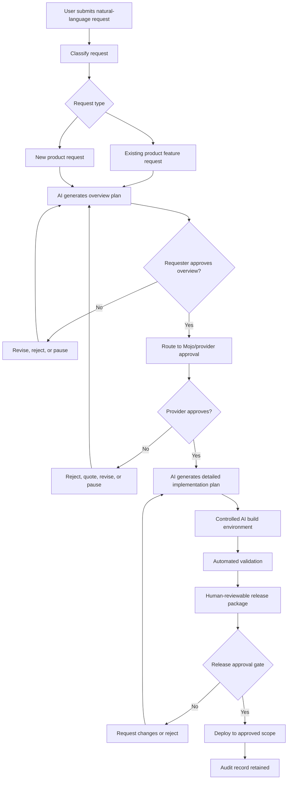
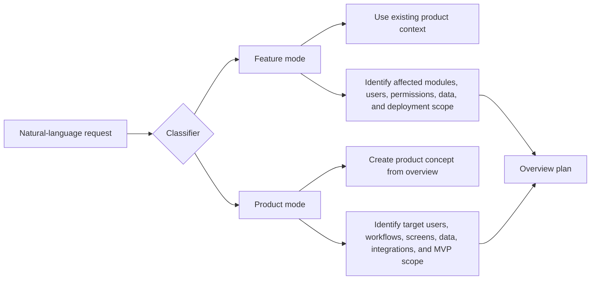
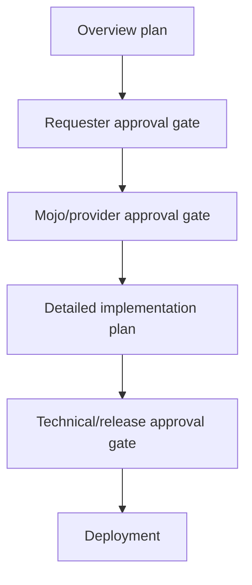
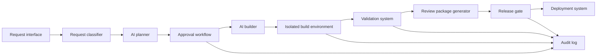

# Process Diagrams

## High-Level Workflow

```mermaid
flowchart TD
  A["User submits natural-language request"] --> B["Classify request"]
  B --> C{"Request type"}
  C --> D["Existing product feature request"]
  C --> E["New product request"]
  D --> F["AI generates overview plan"]
  E --> F
  F --> G{"Requester approves overview?"}
  G -->|No| H["Revise, reject, or pause"]
  H --> F
  G -->|Yes| I["Route to Mojo/provider approval"]
  I --> J{"Provider approves?"}
  J -->|No| K["Reject, quote, revise, or pause"]
  K --> F
  J -->|Yes| L["AI generates detailed implementation plan"]
  L --> M["Controlled AI build environment"]
  M --> N["Automated validation"]
  N --> O["Human-reviewable release package"]
  O --> P{"Release approval gate"}
  P -->|No| Q["Request changes or reject"]
  Q --> L
  P -->|Yes| R["Deploy to approved scope"]
  R --> S["Audit record retained"]
```

## Two Request Modes

```mermaid
flowchart LR
  A["Natural-language request"] --> B{"Classifier"}
  B --> C["Feature mode"]
  B --> D["Product mode"]
  C --> E["Use existing product context"]
  C --> F["Identify affected modules, users, permissions, data, and deployment scope"]
  D --> G["Create product concept from overview"]
  D --> H["Identify target users, workflows, screens, data, integrations, and MVP scope"]
  F --> I["Overview plan"]
  H --> I
```

## Approval Gates

```mermaid
flowchart TD
  A["Overview plan"] --> B["Requester approval gate"]
  B --> C["Mojo/provider approval gate"]
  C --> D["Detailed implementation plan"]
  D --> E["Technical/release approval gate"]
  E --> F["Deployment"]
```

## System Components

```mermaid
flowchart LR
  A["Request interface"] --> B["Request classifier"]
  B --> C["AI planner"]
  C --> D["Approval workflow"]
  D --> E["AI builder"]
  E --> F["Isolated build environment"]
  F --> G["Validation system"]
  G --> H["Review package generator"]
  H --> I["Release gate"]
  I --> J["Deployment system"]
  D --> K["Audit log"]
  F --> K
  G --> K
  I --> K
```
