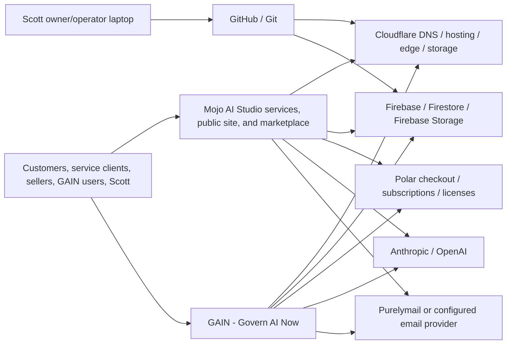
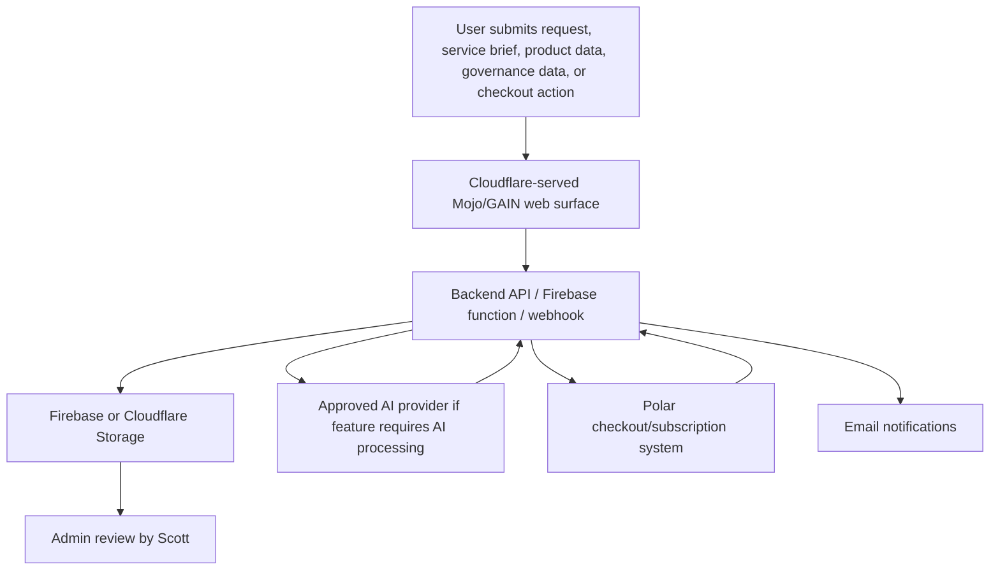

# Solo SOC 2 Readiness Checklist

Draft for a one-person AI services and product company operating primarily on AI providers, GitHub/Git, and Cloudflare.

This is a preparation checklist, not legal, accounting, or audit advice. SOC 2 reports are issued by qualified CPA firms. The goal of this document is to make the readiness work concrete before engaging an auditor.
## Status Legend

<span style="background-color:#dcfce7;color:#166534;padding:2px 6px;border-radius:4px;font-weight:600;">Complete</span> Item has been answered or populated.

<span style="background-color:#fee2e2;color:#991b1b;padding:2px 6px;border-radius:4px;font-weight:600;">Needs input</span> Item still needs a decision, evidence, or verification.

## Working Assumptions

- The company has one operator: Scott.
- There are no employees, contractors, managers, departments, or HR workflows.
- Mojo AI Studio is both a services company and a product company.
- The services side accepts client requests, scopes AI software projects, builds custom AI workflows or applications, and may turn repeatable service work into packaged products.
- The product side lists, sells, supports, and operates AI-powered software products, including GAIN.
- The technical operating surface is intentionally narrow:
  - AI provider or providers
  - Anthropic
  - Open AI
  - Purelymail.com = Email
  - GitHub/Git
  - Cloudflare
  - Local owner/operator device
  - Laptop - home use only. Bit Defender Antivirus
  - Explicitly in-scope customer data stores or supporting vendors
  - Cloudflare Storage
  - Firebase Storage
- The initial SOC 2 scope should be narrow and defensible.
- Security is the likely required Trust Services Category.
- Availability, Confidentiality, Privacy, and Processing Integrity should be added only when they match real customer commitments.

## Positioning Statement

Owner-operated company. No employees or contractors. Separation of duties is not applicable due to company size. Risk is mitigated through limited access, MFA, vendor-managed infrastructure, Git-based change tracking, audit logs, periodic self-review, and documented operating procedures.

## First Decisions

- <span style="background-color:#dcfce7;color:#166534;padding:2px 6px;border-radius:4px;font-weight:600;">Complete</span> Decide whether the target is SOC 2 Type I or SOC 2 Type II.
  - Decision: Type I.

- <span style="background-color:#dcfce7;color:#166534;padding:2px 6px;border-radius:4px;font-weight:600;">Complete</span> Define the exact product or service being assessed.
  - Mojo AI Studio AI services and product delivery system for building, operating, and selling AI-powered software products and custom AI development services operated by Scott, hosted primarily on Cloudflare, managed through GitHub/Git, using approved AI providers, and storing in-scope customer data in Cloudflare Storage and Firebase Storage.

- <span style="background-color:#dcfce7;color:#166534;padding:2px 6px;border-radius:4px;font-weight:600;">Complete</span> Define what is in scope.
  - Mojo AI Studio AI services and product delivery system for building, operating, and selling AI-powered software products and custom AI development services operated by Scott, hosted primarily on Cloudflare, managed through GitHub/Git, using approved AI providers, and storing in-scope customer data in Cloudflare Storage and Firebase Storage.

- <span style="background-color:#dcfce7;color:#166534;padding:2px 6px;border-radius:4px;font-weight:600;">Complete</span> Define what is out of scope.
Out of scope:
- Employees, contractors, managers, departments, and HR workflows
- Employee onboarding/offboarding controls
- Payroll, benefits, HRIS, and personnel management systems
- Office networks or physical office controls
- Corporate device fleet management beyond Scott's single owner/operator laptop
- Products not yet launched or not operating under the documented Mojo control environment
- Customer-managed environments after delivery, unless Mojo continues to operate them
- Customer production systems, credentials, datasets, or environments that are not explicitly accepted into a documented services engagement
- Custom service deliverables after customer handoff, unless Mojo continues to host, operate, monitor, access, or support them
- Third-party vendor internal controls, except through vendor SOC/security reports and vendor review
- Personal files, personal email, and non-business systems
- Marketing/social media systems unless they process in-scope customer data
- Payment processing systems if payments are fully handled by third-party providers and Mojo does not store card data
- Any regulated data or regulated industry workflow not explicitly accepted into scope

- <span style="background-color:#dcfce7;color:#166534;padding:2px 6px;border-radius:4px;font-weight:600;">Complete</span> Choose the initial Trust Services Categories:
  - Decision: Security and Confidentiality are included in the initial Type I scope.
  - <span style="background-color:#dcfce7;color:#166534;padding:2px 6px;border-radius:4px;font-weight:600;">Complete</span> Security
  - <span style="background-color:#dcfce7;color:#166534;padding:2px 6px;border-radius:4px;font-weight:600;">Complete</span> Availability, not included unless uptime becomes a customer commitment
  - <span style="background-color:#dcfce7;color:#166534;padding:2px 6px;border-radius:4px;font-weight:600;">Complete</span> Confidentiality, if sensitive customer data is handled
  - <span style="background-color:#dcfce7;color:#166534;padding:2px 6px;border-radius:4px;font-weight:600;">Complete</span> Privacy, not included unless privacy commitments require it
  - <span style="background-color:#dcfce7;color:#166534;padding:2px 6px;border-radius:4px;font-weight:600;">Complete</span> Processing Integrity, not included unless complete/correct processing becomes a core promise

- <span style="background-color:#dcfce7;color:#166534;padding:2px 6px;border-radius:4px;font-weight:600;">Complete</span> Identify a CPA firm or SOC 2 auditor candidate.
  - Candidate: RS Assurance & Advisory.

- <span style="background-color:#fee2e2;color:#991b1b;padding:2px 6px;border-radius:4px;font-weight:600;">Needs input</span> Ask the auditor how they handle very small owner-operated companies.
- <span style="background-color:#fee2e2;color:#991b1b;padding:2px 6px;border-radius:4px;font-weight:600;">Needs input</span> Ask the auditor what compensating controls they expect when separation of duties is not possible.

## System Description

Source note: Mojo details are based on this repository. GAIN details are based on the `AesopScott/gain` GitHub repository configuration and Mojo documentation. Logged-in dashboard settings still need evidence screenshots/exports before auditor use.

### Actors And Workflows

Actors are separated because different people interact with different parts of the system:

- Buyers/customers: people or organizations that buy Mojo products or subscribe to products listed through Mojo.
- Sellers: third parties submitting products to the Mojo marketplace for review, listing, and potential payout.
- Service clients: customers requesting custom AI development work from Mojo.
- GAIN users: people using the GAIN governance product after signup, subscription, or workspace access.
- Scott: sole owner/operator/admin for Mojo and current SOC 2 readiness owner.

Core workflows:

- Buyer/customer workflow: buyer visits Mojo marketplace, reviews a product listing, starts checkout or follows a product link, purchase/subscription is handled through Polar or product-specific checkout, and buyer receives access to the purchased product.
- Seller workflow: seller submits product, Mojo reviews product, seller completes onboarding where required, product is listed, buyer purchases product, sale/subscription is recorded, and seller payout process runs if applicable.
- Service client workflow: client submits custom AI development request, Mojo reviews/scopes request, client provides requirements or sample data as needed, Mojo builds the custom workflow/app, and Mojo delivers or operates the result depending on the agreement.
- GAIN user workflow: customer visits GAIN or the Mojo listing, selects a plan or starts a free plan, completes Polar checkout if paid, GAIN account/workspace is created or upgraded, user enters AI governance data, and GAIN stores governance records and produces risk register/compliance outputs.

### Mojo AI Studio AI Services And Product Delivery System

- <span style="background-color:#dcfce7;color:#166534;padding:2px 6px;border-radius:4px;font-weight:600;">Complete</span> Describe what the product does.

  Mojo AI Studio operates as both an AI services company and an AI product company. The services side accepts client requests, scopes AI software projects, builds custom AI workflows or applications, and may turn repeatable service work into packaged products. The product side markets Mojo products, lists products for sale, routes buyers to product checkout or product sites, accepts third-party product submissions, supports seller onboarding, and records marketplace purchase/subscription activity through backend services.

  For SOC 2 Type I, the intended shared system boundary is: Mojo AI Studio AI services and product delivery system for building, operating, and selling AI-powered software products and custom AI development services operated by Scott, hosted primarily on Cloudflare, managed through GitHub/Git, using approved AI providers, and storing in-scope customer data in Cloudflare Storage and Firebase Storage/Firestore.

- <span style="background-color:#dcfce7;color:#166534;padding:2px 6px;border-radius:4px;font-weight:600;">Complete</span> Describe the actors served.

  Mojo serves distinct actor groups: buyers/customers purchasing AI software, service clients requesting custom AI development, sellers submitting AI software to the Mojo marketplace, GAIN users using the GAIN governance product, and Scott as the sole owner/operator/admin. Sellers are not buyers/users of purchased products unless they also separately buy or use a product. Advanced AI Concepts visitors and Meetup/SMS reminder participants should be included only if those event/reminder workflows remain in SOC 2 scope.

- <span style="background-color:#dcfce7;color:#166534;padding:2px 6px;border-radius:4px;font-weight:600;">Complete</span> Describe what data enters the system.

  Data entering the Mojo system may include buyer/customer product inquiry details, custom project brief submissions, service client requirements, client-provided sample data or documents, service scoping notes, custom build artifacts, seller product submission details, seller contact information, seller onboarding information, signed contract metadata, encrypted seller bank details, Polar order/subscription webhook events, buyer/customer email addresses, purchase/subscription records, admin actions, SMS reminder phone numbers and consent records if included, and product/customer inputs sent to in-scope AI workflows.

- <span style="background-color:#dcfce7;color:#166534;padding:2px 6px;border-radius:4px;font-weight:600;">Complete</span> Describe what data leaves the system.

  Data leaving the Mojo system may include buyer/customer confirmation emails, project scoping responses, proposals or build plans, custom service deliverables, handoff documentation, seller onboarding emails, seller payout or product status emails, webhook responses, checkout redirects, product links to GAIN or other product sites, admin dashboard responses, customer-facing marketplace pages, and AI outputs generated by in-scope product or service workflows. Mojo should not store or process payment card data directly; payment processing is handled by Polar and its payment processor.

- <span style="background-color:#dcfce7;color:#166534;padding:2px 6px;border-radius:4px;font-weight:600;">Complete</span> Describe where data is stored.

  Mojo data is stored in GitHub for source code, service/product artifacts, documentation, and change history; Cloudflare for hosted site/application assets and Cloudflare-managed logs/configuration; Firebase/Firestore/Firebase Storage for buyer/customer purchases, seller records, product records, service intake, and operational records where used; Cloudflare Storage where used for in-scope product/platform/service data; Polar for checkout/subscription/payment metadata; Purelymail or the configured email provider for business email; and Scott's local owner/operator device for approved administrative work and audit evidence.

- <span style="background-color:#dcfce7;color:#166534;padding:2px 6px;border-radius:4px;font-weight:600;">Complete</span> Describe where AI providers process data.

  In-scope AI processing occurs only when a Mojo product workflow, custom development workflow, or administrative workflow sends prompts, files, customer inputs, or product data to approved AI providers. Approved AI providers currently listed for scope are Anthropic and OpenAI. Each product workflow should document whether customer data is sent to Anthropic/OpenAI, what data types are sent, whether prompts/outputs are logged, and the provider retention/training settings.

- <span style="background-color:#dcfce7;color:#166534;padding:2px 6px;border-radius:4px;font-weight:600;">Complete</span> Describe what Cloudflare does.

  Cloudflare provides DNS, edge delivery, hosting for static/public Mojo pages, Workers/Pages runtime where used, routing, TLS, edge security features, environment variables/secrets where configured, audit logs, and Cloudflare Storage where used. Cloudflare is a key subservice organization for hosting, delivery, and edge security.

- <span style="background-color:#dcfce7;color:#166534;padding:2px 6px;border-radius:4px;font-weight:600;">Complete</span> Describe what GitHub does.

  GitHub stores source code, service build artifacts, product documentation, version history, issues/backlog where used, GitHub Actions/workflow definitions where used, repository secrets where configured, and change evidence. GitHub/Git is the primary change management record for Mojo services work and product work.

- <span style="background-color:#dcfce7;color:#166534;padding:2px 6px;border-radius:4px;font-weight:600;">Complete</span> Describe the deployment flow.

  Scott makes changes locally, commits changes to Git/GitHub, and deploys the relevant service, site, or product components to Cloudflare and/or Firebase. Cloudflare serves the public Mojo web surface and any in-scope hosted product/service surfaces. Firebase Cloud Functions/Firestore support backend workflows such as Polar webhook handling, product records, seller records, purchase records, service intake records, and administrative operations. Emergency changes must be traceable back to Git commits or a documented emergency-change note.

- <span style="background-color:#dcfce7;color:#166534;padding:2px 6px;border-radius:4px;font-weight:600;">Complete</span> Describe the owner/operator responsibilities.

  Scott is responsible for client intake, project scoping, custom build delivery, product operations, account access, MFA, vendor management, repository management, change control, deployments, policy approval, customer support, security review, access reviews, incident response, backup/recovery checks, vulnerability tracking, audit evidence collection, and SOC 2 readiness activities.

- <span style="background-color:#dcfce7;color:#166534;padding:2px 6px;border-radius:4px;font-weight:600;">Complete</span> Document that Scott is the only administrator/operator.

  Scott is the only Mojo administrator/operator. There are no employees, contractors, managers, departments, or HR workflows in scope. Separation of duties is not applicable due to company size and is addressed through compensating controls such as MFA, least privilege, Git history, protected branches or equivalent controls, Cloudflare/GitHub audit logs, documented self-review, and vendor-managed infrastructure controls.

- <span style="background-color:#dcfce7;color:#166534;padding:2px 6px;border-radius:4px;font-weight:600;">Complete</span> Document system boundaries.

  In scope: Mojo public services and product delivery system, Mojo marketplace/product pages, request/product submission workflows, client service intake/scoping records, in-scope custom build artifacts, in-scope backend APIs, in-scope Firebase/Firestore/Firebase Storage records, Cloudflare-hosted assets and Workers/Pages where used, Cloudflare DNS/security/logging, GitHub repository and change history, approved AI provider usage for in-scope product and service workflows, Polar checkout/subscription metadata for covered products, and Scott's owner/operator laptop.

  Conditional scope: Advanced AI Concepts event pages, Meetup automation, and SMS reminder workflows should be included only if the auditor and Scott decide they are part of the product delivery/security boundary.

- <span style="background-color:#dcfce7;color:#166534;padding:2px 6px;border-radius:4px;font-weight:600;">Complete</span> Document excluded systems.

  Out of scope: employees, contractors, HR systems, payroll, office networks, customer-managed environments after delivery unless Mojo continues to operate or support them, customer production systems/credentials/datasets not explicitly accepted into a documented services engagement, vendor internal systems beyond vendor SOC/security review, personal systems/files/email, marketing/social channels unless processing in-scope customer data, direct payment card processing, regulated workflows not explicitly accepted into scope, and products not operating under the documented Mojo control environment.

### GAIN - Govern AI Now

- <span style="background-color:#dcfce7;color:#166534;padding:2px 6px;border-radius:4px;font-weight:600;">Complete</span> Describe what the product does.

  GAIN - Govern AI Now is an AI governance product sold through Mojo and operated at governainow.com. It helps organizations build and manage an AI governance program, including AI system inventory, risk register, AI Impact Assessments, compliance checklists, workspace/team limits, plan-gated features, and audit/governance outputs mapped to frameworks such as NIST AI RMF, ISO 42001, EU AI Act, HIPAA, FERPA, and GLBA.

- <span style="background-color:#dcfce7;color:#166534;padding:2px 6px;border-radius:4px;font-weight:600;">Complete</span> Describe the actors served.

  GAIN users include startups, single-product organizations, mid-market teams, regulated teams, enterprise/multi-business-unit customers, and MSSPs managing client AI governance workspaces. Internal administrative users are limited to Scott unless additional GAIN administrators are explicitly added later.

- <span style="background-color:#dcfce7;color:#166534;padding:2px 6px;border-radius:4px;font-weight:600;">Complete</span> Describe what data enters the system.

  Data entering GAIN may include account registration details, customer email addresses, workspace/team configuration, AI system inventory, AI use cases, risk register entries, AI Impact Assessment responses, compliance checklist responses, governance notes/evidence, plan selections, Polar order/subscription/license events, and support/customer communications. For MSSP plans, data may include client workspace names and client governance records.

- <span style="background-color:#dcfce7;color:#166534;padding:2px 6px;border-radius:4px;font-weight:600;">Complete</span> Describe what data leaves the system.

  Data leaving GAIN may include governance program outputs, risk register exports, AI Impact Assessment outputs, compliance checklist outputs, audit trail/governance reports, plan status changes, customer emails, checkout redirects, subscription/license validation responses, and administrative dashboard outputs. Payment card data is not handled by GAIN directly; payment processing is handled by Polar and its payment processor.

- <span style="background-color:#dcfce7;color:#166534;padding:2px 6px;border-radius:4px;font-weight:600;">Complete</span> Describe where data is stored.

  GAIN uses Firebase project `gain-e89d8` with Firestore, Firebase Storage rules, Firebase Functions, and Firebase Auth for users, companies/workspaces, plan-gating fields, subscription state, governance records, and supported file/evidence storage. Polar stores checkout, subscription, customer, license, and payment metadata. Exact retention periods still need to be defined for customer-facing commitments.

- <span style="background-color:#dcfce7;color:#166534;padding:2px 6px;border-radius:4px;font-weight:600;">Complete</span> Describe where AI providers process data.

  GAIN may use approved AI providers, including Anthropic and OpenAI, to assist with governance content, risk analysis, assessment support, checklist interpretation, summaries, and user-facing guidance. In-scope AI processing should be documented by feature: what customer data is sent, which provider/model receives it, whether prompts/outputs are logged, whether provider training is disabled, retention settings, and human review expectations.

- <span style="background-color:#dcfce7;color:#166534;padding:2px 6px;border-radius:4px;font-weight:600;">Complete</span> Describe what Cloudflare does.

  Cloudflare provides DNS/TLS/edge delivery and Cloudflare Pages hosting for `governainow.com`. The GAIN GitHub Action deploys the `public/` directory to Cloudflare Pages project `governainow-com`.

- <span style="background-color:#dcfce7;color:#166534;padding:2px 6px;border-radius:4px;font-weight:600;">Complete</span> Describe what GitHub does.

  GitHub/Git serves as the source control and change management record for the GAIN codebase in private repository `AesopScott/gain`, default branch `main`.

- <span style="background-color:#dcfce7;color:#166534;padding:2px 6px;border-radius:4px;font-weight:600;">Complete</span> Describe the deployment flow.

  GAIN is operated at `https://governainow.com/`. GitHub Actions deploys `public/` to Cloudflare Pages project `governainow-com`. Firebase config defines Functions source `functions`, Firestore rules/indexes, Storage rules, and Firebase Hosting config. GAIN includes Polar webhook handling in Firebase Functions; Polar sends subscription/order events to the webhook, which updates Firestore plan/subscription records used for feature gating.

- <span style="background-color:#dcfce7;color:#166534;padding:2px 6px;border-radius:4px;font-weight:600;">Complete</span> Describe the owner/operator responsibilities.

  Scott is responsible for GAIN product administration, vendor access, AI provider configuration, customer support, plan/product configuration, Polar integration, webhook monitoring, data handling rules, change management, incident response, access review, and audit evidence collection unless a future GAIN-specific operator is added.

- <span style="background-color:#dcfce7;color:#166534;padding:2px 6px;border-radius:4px;font-weight:600;">Complete</span> Document that Scott is the only administrator/operator.

  Scott is currently treated as the only GAIN administrator/operator for this readiness draft. If GAIN has any separate admin users, contractors, MSSP support users, or service accounts with administrative capabilities, those must be added to the access inventory before audit use.

- <span style="background-color:#dcfce7;color:#166534;padding:2px 6px;border-radius:4px;font-weight:600;">Complete</span> Document system boundaries.

  In scope: GAIN web application at governainow.com, GAIN plan and subscription handling, GAIN user/company/workspace governance data, GAIN AI provider processing for in-scope features, GAIN Firebase/Firestore/Firebase Storage records where used, GAIN Cloudflare-hosted assets/storage where used, Polar checkout/license/subscription metadata, and the GAIN GitHub/Git change record.

- <span style="background-color:#dcfce7;color:#166534;padding:2px 6px;border-radius:4px;font-weight:600;">Complete</span> Document excluded systems.

  Out of scope: customer systems governed or documented inside GAIN, customer internal AI tools themselves, customer compliance decisions, Polar internal payment processor controls beyond vendor review, AI provider internal controls beyond vendor review, GAIN features not deployed or not operating under the documented control environment, and any separate GAIN systems not verified during scope confirmation.

### Simple Architecture Diagram



### Simple Data Flow Diagram



### Production URLs, APIs, Dashboards, And Repositories

- <span style="background-color:#dcfce7;color:#166534;padding:2px 6px;border-radius:4px;font-weight:600;">Complete</span> Production URLs
  - `https://mojoaistudio.com/`
  - `https://mojoaistudio.com/products/`
  - `https://mojoaistudio.com/request/`
  - `https://mojoaistudio.com/sell/`
  - `https://mojoaistudio.com/request/pages/brief.html`
  - `https://mojoaistudio.com/watch/` or `/learn/` if Advanced AI Concepts remains in scope
  - `https://governainow.com/`
  - `https://governainow.com/pricing.html`
  - `https://governainow.com/mssp-pricing.html`

- <span style="background-color:#dcfce7;color:#166534;padding:2px 6px;border-radius:4px;font-weight:600;">Complete</span> Production APIs and webhooks
  - Mojo PHP API endpoints under `https://mojoaistudio.com/api/...`
  - Mojo Firebase Cloud Functions for Polar, product, seller, payout, and admin workflows
  - GAIN Polar webhook: `https://polarwebhook-hmkyyu2gma-uc.a.run.app`
  - GAIN app webhook/API endpoint to verify: `https://governainow.com/api/polar-webhook`

- <span style="background-color:#dcfce7;color:#166534;padding:2px 6px;border-radius:4px;font-weight:600;">Complete</span> Admin dashboards and consoles
  - Cloudflare dashboard
  - GitHub repository settings and audit/security logs
  - Firebase Console for project `mojo-f86de`
  - Firebase Console for GAIN project `gain-e89d8`
  - Polar dashboard for `mind-share-media-llc`
  - Anthropic Console
  - OpenAI Platform
  - Purelymail admin
  - Domain registrar admin
  - Mojo admin pages, if included in scope

- <span style="background-color:#dcfce7;color:#166534;padding:2px 6px;border-radius:4px;font-weight:600;">Complete</span> Repositories
  - `AesopScott/mojo`
  - `AesopScott/gain` at `https://github.com/AesopScott/gain`

## Vendor Inventory

Source note: this inventory is based on the current checklist assumptions and vendor/integration references found in this Mojo repository. Items marked "conditional" should be confirmed before audit use.

### Core Vendors And Systems

These are expected to be in the first Type I scope unless Scott or the auditor removes them.

#### Cloudflare

- Scope status: Core
- Purpose: DNS, TLS, edge delivery, hosting, Workers/Pages, security controls, audit logs, and Cloudflare Storage where used.
- Data processed or stored: Site/application assets, edge logs, configuration, secrets/environment variables where configured, and in-scope storage objects if Cloudflare Storage is used.
- Criticality: High
- Owner: Scott
- Evidence to collect:
  - Cloudflare SOC 2 report
  - Account MFA/users
  - DNS records
  - Worker/Pages projects
  - Secrets/environment variables
  - Audit logs
  - Storage configuration

#### GitHub / Git

- Scope status: Core
- Purpose: Source control, change history, documentation, workflow files, repository settings, and security features.
- Data processed or stored: Source code, documentation, issues/backlog where used, repository secrets, GitHub Actions logs/configuration.
- Criticality: High
- Owner: Scott
- Evidence to collect:
  - GitHub SOC 2 report
  - MFA and repository access
  - Branch protection
  - Dependabot/code scanning
  - Secrets review
  - Audit/security logs

#### Google Firebase / Firestore / Firebase Storage / Cloud Functions

- Scope status: Core
- Purpose: Backend data store, file/object storage, Cloud Functions, and Firebase project operations.
- Data processed or stored: Purchases, sellers, products, sales, contracts, service intake records where used, encrypted seller bank details, operational logs, and GAIN data if verified.
- Criticality: High
- Owner: Scott
- Evidence to collect:
  - All Firebase projects in scope
  - Project IAM
  - Firestore rules and indexes
  - Storage rules
  - Cloud Functions
  - Secrets
  - Backup/export approach
  - Google/Firebase trust documentation

#### Anthropic

- Scope status: Core AI provider
- Purpose: Approved AI model/API provider for in-scope product, service, and administrative workflows.
- Data processed or stored: Prompts, inputs, files, outputs, and customer/client data only when an approved workflow sends it.
- Criticality: High if customer data is sent
- Owner: Scott
- Evidence to collect:
  - Account access
  - API keys
  - Data retention/training settings
  - Trust/security documentation
  - Feature-level data-use mapping

#### OpenAI

- Scope status: Core AI provider
- Purpose: Approved AI model/API provider for in-scope product, service, and administrative workflows.
- Data processed or stored: Prompts, inputs, files, outputs, and customer/client data only when an approved workflow sends it.
- Criticality: High if customer data is sent
- Owner: Scott
- Evidence to collect:
  - Account access
  - API keys
  - Data retention/training settings
  - Trust/security documentation
  - Feature-level data-use mapping

#### Polar.sh

- Scope status: Core payment/subscription vendor
- Purpose: Checkout, subscriptions, product IDs, license keys, webhook events, and buyer purchase metadata.
- Data processed or stored: Buyer/customer email, subscription status, plan, order/payment metadata, and license key metadata.
- Criticality: High
- Owner: Scott
- Evidence to collect:
  - Account MFA/users
  - Product and price configuration
  - Webhook settings
  - Webhook secret storage
  - Vendor trust documentation
  - Confirmation that Mojo does not store payment card data

#### Purelymail.com

- Scope status: Core email provider per current assumption
- Purpose: Business email and/or configured email provider.
- Data processed or stored: Business email content, customer/seller/service-client communications, and admin email.
- Criticality: Medium
- Owner: Scott
- Evidence to collect:
  - Confirm actual production email flow
  - Account MFA/users
  - Mailbox aliases
  - Retention/forwarding settings
  - Security settings
  - Vendor documentation

#### Domain Registrar

- Scope status: Core
- Name: Cloudflare
- Purpose: Domain ownership, registrar services, and DNS delegation.
- Data processed or stored: Domain account metadata, DNS delegation, and contact details.
- Criticality: High
- Owner: Scott
- Evidence to collect:
  - Account MFA/users
  - Domain lock
  - Renewal settings
  - Nameserver settings

#### Bitdefender

- Scope status: Core endpoint protection
- Purpose: Antivirus/endpoint protection on Scott's home-use laptop.
- Data processed or stored: Device security status, malware/quarantine events, and endpoint protection configuration.
- Criticality: Medium
- Owner: Scott
- Evidence to collect:
  - Product/license
  - Active protection status
  - Update status
  - Scan schedule
  - Relevant screenshots or export

#### Scott Owner/Operator Laptop

- Scope status: Core asset, not a vendor
- Purpose: Sole administrative workstation for development, admin access, and evidence collection.
- Data processed or stored: Local work files, local repository clones, browser sessions, credentials via password manager, and audit evidence.
- Criticality: High
- Owner: Scott
- Evidence to collect:
  - Disk encryption status
  - OS update status
  - Screen lock settings
  - Antivirus status
  - Lost-device procedure
  - Local secrets review

### Conditional Vendors And Systems

These should be included only if they remain in the first Type I scope.

#### Resend

- Scope status: In scope for first Type I
- Purpose: Transactional email for PHP integration and related production email workflows.
- Data processed or stored: Recipient email addresses, transactional email content, and delivery metadata.
- Criticality: Medium
- Owner: Scott
- Follow-up: Capture account MFA/users, API keys, sending domains, sender identities, delivery logs/retention, and vendor trust/security documentation.

#### PHP Mail / Web Host Mail Relay

- Scope status: In scope for first Type I
- Purpose: Sends form auto-replies and admin emails from PHP endpoints.
- Data processed or stored: Contact emails, form contents, seller/product/service-client messages.
- Criticality: Medium
- Owner: Scott
- Follow-up: Document the production PHP mail relay path and capture provider/security docs and retention settings.

#### Twilio

- Scope status: Out of scope for first Type I
- Purpose: SMS reminders and test messages for Advanced AI Concepts event workflows.
- Data processed or stored: Phone numbers, SMS consent, reminder message content, and delivery metadata.
- Criticality: Medium
- Owner: Scott
- Follow-up: Do not collect first Type I evidence unless Advanced AI Concepts/SMS workflows are brought into scope later.

#### Meetup

- Scope status: Out of scope for first Type I
- Purpose: Event registrations, RSVPs, group/member data, and OAuth/GraphQL automation.
- Data processed or stored: Meetup member/registrant names, emails where available, RSVP/event metadata, and OAuth tokens.
- Criticality: Medium
- Owner: Scott
- Follow-up: Do not collect first Type I evidence unless Advanced AI Concepts workflows are brought into scope later.

#### Zoom

- Scope status: Out of scope for first Type I
- Purpose: Live sessions, meeting links, recordings, webhook events, and activity summary.
- Data processed or stored: Registrant/participant info if collected, meeting metadata, recording links, and webhook events.
- Criticality: Medium
- Owner: Scott
- Follow-up: Do not collect first Type I evidence unless Advanced AI Concepts/Zoom workflows are brought into scope later.

#### Cloudflare Analytics API

- Scope status: Out of scope as a separate API integration for first Type I
- Purpose: Cloudflare's built-in dashboard analytics may be used as part of the base Cloudflare service. The separate Cloudflare Analytics API is not used in the first Type I scope.
- Data processed or stored: Site analytics and visitor/request metadata exposed by Cloudflare analytics.
- Criticality: Low/Medium
- Owner: Scott
- Follow-up: Include base Cloudflare analytics under Cloudflare evidence. Do not include separate Analytics API tokens, API scripts, or API evidence unless the API is later used.

#### Google Workspace

- Scope status: Conditional / verify
- Purpose: GAIN SSO option and/or customer identity provider integration; may also be used as an admin/business tool if configured.
- Data processed or stored: Identity assertions, user email/name, and workspace membership if enabled.
- Criticality: Medium
- Owner: Scott
- Follow-up: Treat customer-provided SSO as customer-controlled unless Mojo operates it. Verify whether Mojo uses Google Workspace internally.

#### SAML / Okta / Azure AD

- Scope status: Conditional / future enterprise
- Purpose: GAIN enterprise SSO integrations.
- Data processed or stored: Identity assertions and workspace access data if enabled by customers.
- Criticality: Medium
- Owner: Scott
- Follow-up: Include as customer identity integrations only when deployed. Document shared responsibility.

#### Brevo

- Scope status: Conditional / verify
- Purpose: Mentioned in GAIN integration docs as optional welcome/plan-change email sender.
- Data processed or stored: Customer email addresses, transactional email content, and delivery metadata.
- Criticality: Medium
- Owner: Scott
- Follow-up: Verify whether GAIN actually uses Brevo. If not, mark out of scope.

#### HubSpot / Gmail / Slack / Google Sheets / Calendar

- Scope status: Future product integration / conditional
- Purpose: Listed as integrations for marketplace products or future product surfaces.
- Data processed or stored: Customer-provided integration data only if those products are active and in scope.
- Criticality: Medium/High depending on product
- Owner: Scott
- Follow-up: Keep out of first SOC 2 scope unless the related product is live and operated under Mojo controls.

### Inventory Tasks

- <span style="background-color:#dcfce7;color:#166534;padding:2px 6px;border-radius:4px;font-weight:600;">Complete</span> Confirm which conditional vendors are in first Type I scope.
  - In scope: Purelymail.com, PHP mail relay, and Resend.com for PHP integration.
  - Out of scope for first Type I: Advanced AI Concepts, Meetup, Twilio, Zoom, separate Cloudflare Analytics API usage, and future product integrations.
  - Conditional/later only: Google Workspace, SAML/Okta/Azure AD, Brevo, and other integrations if they become live, customer-connected, and operated under Mojo controls.

- <span style="background-color:#dcfce7;color:#166534;padding:2px 6px;border-radius:4px;font-weight:600;">Complete</span> Identify the domain registrar.
  - Domain registrar: Cloudflare.
  - Needed evidence: account MFA/users, domain lock, renewal settings, and nameserver settings.

- <span style="background-color:#dcfce7;color:#166534;padding:2px 6px;border-radius:4px;font-weight:600;">Complete</span> Confirm the production email provider path.
  - Production email path: Purelymail.com, PHP mail relay, and Resend.com for PHP integration.

- <span style="background-color:#dcfce7;color:#166534;padding:2px 6px;border-radius:4px;font-weight:600;">Complete</span> Confirm the GAIN Firebase/hosting repository and production vendor stack.
  - Repository: private GitHub repo `AesopScott/gain`, default branch `main`, description `GovernAINow.com`.
  - Firebase project: `gain-e89d8` from `.firebaserc`.
  - Firebase config: `firebase.json` defines `functions` source `functions`, `storage.rules`, Firebase Hosting public directory `public`, clean URLs, `/app` and `/app/**` rewrites to `dashboard.html`, Firestore rules, and Firestore indexes.
  - Firebase Functions: `functions/package.json` uses Node 22 with `firebase-admin`, `firebase-functions`, `jszip`, and `nodemailer`.
  - GAIN production hosting: GitHub Actions deploys `public/` to Cloudflare Pages project `governainow-com` using `cloudflare/wrangler-action@v3`.
  - GAIN backend/data stack: Firebase Auth/Firestore/Storage/Cloud Functions, Cloudflare Pages, GitHub Actions, Purelymail SMTP via `smtp.purelymail.com`, Anthropic API key, Polar webhook secret, GitHub connector/webhook secrets, and managed connector webhook secret.
  - GAIN evidence to collect: Firebase project IAM, Firestore rules, Storage rules, Cloud Functions list, configured secrets names, Cloudflare Pages project settings, deployment history, GitHub Actions history, branch protection, and Polar webhook configuration.

- <span style="background-color:#dcfce7;color:#166534;padding:2px 6px;border-radius:4px;font-weight:600;">Complete</span> Confirm whether Advanced AI Concepts, Meetup, Twilio, and Zoom workflows are in scope or explicitly out of scope.
  - Decision: not in scope for first Type I.

- <span style="background-color:#dcfce7;color:#166534;padding:2px 6px;border-radius:4px;font-weight:600;">Complete</span> Decide whether Cloudflare Analytics API is in first Type I scope.
  - Decision: the separate Cloudflare Analytics API is not in first Type I scope.
  - Scope treatment: base Cloudflare dashboard analytics and request metadata remain part of Cloudflare as a core vendor, but there is no separate Analytics API integration to assess.

- <span style="background-color:#dcfce7;color:#166534;padding:2px 6px;border-radius:4px;font-weight:600;">Complete</span> Decide whether future product integrations are in first Type I scope.
  - Repo evidence: products list mentions Gmail, HubSpot, Slack, Google Sheets, Calendar, SAML/Okta/Azure AD, and Google Workspace.
  - Decision: future product integrations are not in first Type I scope.

- <span style="background-color:#dcfce7;color:#166534;padding:2px 6px;border-radius:4px;font-weight:600;">Complete</span> Record vendor owner, purpose, data processed, criticality, and scope status for each vendor.
  - Completed in the core and conditional vendor sections above.

- <span style="background-color:#dcfce7;color:#166534;padding:2px 6px;border-radius:4px;font-weight:600;">Complete</span> Identify where to download or request SOC/security documentation.
  - Cloudflare: download SOC 2 and compliance documents from the Cloudflare dashboard; Cloudflare says Super Administrators can access compliance documents from the dashboard.
  - GitHub: organization owners can access GitHub compliance reports, including SOC reports, from organization compliance report settings.
  - Google/Firebase: download Google Cloud/Firebase SOC and ISO documentation from Google Compliance Reports Manager; Firebase states Firebase services have completed SOC 1, SOC 2, and SOC 3 evaluation processes.
  - Anthropic: request compliance artifacts through the Anthropic Trust Center and record API data retention/model-training settings.
  - OpenAI: request SOC 2 through the OpenAI Trust Portal and record API data retention/training settings.
  - Polar.sh: collect privacy, master services/security safeguard language, payment processor partner documentation, webhook/authentication docs, and request additional security/SOC documentation from Polar support if required by the auditor.
  - Purelymail.com: collect Purelymail security, privacy, and 2FA documentation.
  - Resend.com: collect Resend security documentation and request SOC/security documentation if not available in the account.
  - Bitdefender: collect Bitdefender Central account 2FA documentation plus local product status/update/scan evidence.
  - PHP mail relay/provider: identify the actual provider, then collect its security/privacy/SOC documentation.
  - Conditional/later only: Meetup, Twilio, Zoom, Brevo, Google Workspace, Okta/Azure AD if later included.

- <span style="background-color:#dcfce7;color:#166534;padding:2px 6px;border-radius:4px;font-weight:600;">Complete</span> Define vendor security/privacy documentation review requirement.
  - Requirement: review in-scope vendor security/privacy/SOC documentation before Type I, then at least annually, and also after a material vendor, scope, hosting, data type, or contractual change.
  - Annual review evidence should show the review date, reviewer, documents reviewed, security/compliance posture, risks or exceptions, decision to keep/replace the vendor, and next review date.

- <span style="background-color:#fee2e2;color:#991b1b;padding:2px 6px;border-radius:4px;font-weight:600;">Needs input</span> Record vendor review dates and notes.
  - Suggested fields: vendor, scope status, review date, reviewer, docs reviewed, risks noted, decision, next review date.

## Access Control

- <span style="background-color:#dcfce7;color:#166534;padding:2px 6px;border-radius:4px;font-weight:600;">Complete</span> Access control standard drafted.
  - Only Scott should have administrative access unless a specific vendor/customer support need is documented.
  - Every in-scope admin account must use a unique password and MFA where the vendor supports it.
  - API keys, tokens, repository secrets, Cloudflare secrets, Firebase secrets, and AI provider keys must be reviewed at least quarterly and after any suspected exposure.
  - Shared human accounts are not allowed. Service credentials are allowed only when scoped, named, stored in the vendor secret store, and reviewed.

- <span style="background-color:#dcfce7;color:#166534;padding:2px 6px;border-radius:4px;font-weight:600;">Complete</span> MFA support matrix created.
  - Cloudflare: supports 2FA with security keys, TOTP apps, and email. Enable for Scott and enable account-level 2FA enforcement if available.
  - GitHub: supports 2FA, passkeys, security keys, and TOTP. Enable for Scott and save recovery codes.
  - Google/Firebase: Google Cloud requires/uses 2-Step Verification. Confirm Scott's Google account used for Firebase has 2SV enabled.
  - Purelymail: supports 2FA with TOTP and security keys. Enable and create app passwords only where needed for mail clients/SMTP.
  - Bitdefender Central: supports 2FA. Enable for the Bitdefender account used to manage endpoint protection.
  - OpenAI: OpenAI business/API materials indicate MFA/SSO support for business/API account security. Confirm and enable MFA on the account used for production API keys.
  - Anthropic: public docs confirm phone verification and commercial data controls, but current MFA support for Scott's exact Anthropic Console account was not confirmed from public docs. Verify in the logged-in account.
  - Polar.sh: account/team roles and token controls are documented, but MFA support was not confirmed from public docs. Verify in the logged-in account.
  - Resend.com: security documentation exists, but MFA support was not confirmed from public docs. Verify in the logged-in account.
  - PHP mail relay/provider: provider unknown. Identify the provider, then enable MFA on the provider account.

- <span style="background-color:#fee2e2;color:#991b1b;padding:2px 6px;border-radius:4px;font-weight:600;">Needs input</span> Enable or confirm MFA ASAP on Cloudflare, GitHub, Google/Firebase, Purelymail, Bitdefender Central, OpenAI, Anthropic, Polar, Resend, and the PHP mail relay/provider.
  - Evidence: screenshot/export showing MFA enabled, current users, recovery methods stored, and date verified.

- <span style="background-color:#fee2e2;color:#991b1b;padding:2px 6px;border-radius:4px;font-weight:600;">Needs input</span> Confirm password manager in use.
- Dashlane
  ![[Pasted image 20260616133724.png|246]]
  - Minimum: unique generated passwords, MFA on the password manager account, recovery plan documented.
    ![[Pasted image 20260616133846.png|203]]

- <span style="background-color:#fee2e2;color:#991b1b;padding:2px 6px;border-radius:4px;font-weight:600;">Needs input</span> Complete first quarterly access review.
  - Review Cloudflare users/tokens, GitHub users/collaborators/secrets, Firebase IAM/service accounts/secrets, AI provider users/API keys, domain registrar access, email provider access, Polar access/webhooks, Resend/API keys, and local device admin accounts.
  - Record explicitly: "Scott is the only administrator/operator" or list any exceptions.

- <span style="background-color:#dcfce7;color:#166534;padding:2px 6px;border-radius:4px;font-weight:600;">Complete</span> Root `.env` reviewed for service/key inventory without copying secret values.
  - Review date: 2026-06-16.
  - Rule: never copy secret values into this checklist. Record variable names, purpose, storage location, owner, and whether a value exists.
  - Root `.env` found at project root and contains populated variables for Cloudflare, Polar, Meetup, and Zoom. Empty variables were also identified.

### Access Review From Root `.env`

Use this section as the first-pass access/key inventory. Screenshots still need to confirm actual users, MFA, scopes, last-used dates, and vendor dashboard settings.

#### Cloudflare / Domain Registrar

- <span style="background-color:#dcfce7;color:#166534;padding:2px 6px;border-radius:4px;font-weight:600;">Complete</span> Root `.env` contains Cloudflare configuration variables.
  - Present with values: `CF_ACCOUNT_ID`, `CF_API_TOKEN`, `CF_ZONE_ID`, `CLOUDFLARE_API_TOKEN`.
  - Purpose: Cloudflare account/zone/API access for DNS, Pages, and deployment automation.
  - Note: `CF_API_TOKEN` and `CLOUDFLARE_API_TOKEN` both exist. Confirm whether they are the same token, aliases for different tools, or one is stale.
- <span style="background-color:#fee2e2;color:#991b1b;padding:2px 6px;border-radius:4px;font-weight:600;">Needs input</span> Cloudflare screenshots/evidence.
  - Capture account users, MFA status, API token list, token scopes, token last-used/created dates if available, Pages projects, DNS records, domain lock/registrar settings, renewal settings, and audit logs.

#### GitHub / Git

- <span style="background-color:#dcfce7;color:#166534;padding:2px 6px;border-radius:4px;font-weight:600;">Complete</span> Root `.env` does not contain a GitHub personal access token.
  - GitHub access review must be performed in GitHub, not from `.env`.
  - GitHub Actions secrets are referenced by workflows but their values are stored in GitHub, not visible in root `.env`.
- <span style="background-color:#fee2e2;color:#991b1b;padding:2px 6px;border-radius:4px;font-weight:600;">Needs input</span> GitHub screenshots/evidence.
  - Capture repository collaborators, organization/repository access, branch protection, Actions secrets names, Dependabot/security settings, audit/security logs, and workflow deployment history.

#### Firebase / Google Cloud

- <span style="background-color:#dcfce7;color:#166534;padding:2px 6px;border-radius:4px;font-weight:600;">Complete</span> Firebase project is documented in repo config, not root `.env`.
  - Mojo Firebase project: `mojo-f86de` from `.firebaserc`.
  - Root `.env` does not show Firebase IAM users, service accounts, service account keys, or Firebase project credentials.
  - `POLAR_WEBHOOK_SECRET` is present in root `.env`, but production Firebase Functions should use Firebase Secret Manager for runtime secrets.
- <span style="background-color:#fee2e2;color:#991b1b;padding:2px 6px;border-radius:4px;font-weight:600;">Needs input</span> Firebase secrets not found in root `.env` but referenced by code/config.
  - Not found in root `.env`: `SELLER_ENCRYPTION_KEY`, `ADMIN_PAYOUT_KEY`, `SOCIAL_ADMIN_KEY`, `RESEND_API_KEY`, `FIREBASE_API_KEY`.
  - Confirm whether each is stored in Firebase Secret Manager, GitHub Actions secrets, Cloudflare Pages secrets, or another secret store.
- <span style="background-color:#fee2e2;color:#991b1b;padding:2px 6px;border-radius:4px;font-weight:600;">Needs input</span> Firebase/Google screenshots/evidence.
  - Capture Firebase/Google IAM users, service accounts, service account keys, Cloud Functions list, configured secrets names, Firestore rules/indexes deployment, and MFA/2SV for Scott's Google account.

#### AI Providers

- <span style="background-color:#fee2e2;color:#991b1b;padding:2px 6px;border-radius:4px;font-weight:600;">Needs input</span> AI provider keys not found in root `.env`.
  - Not found in root `.env`: OpenAI API key, Anthropic API key, OpenAI organization/project identifiers, Anthropic workspace/project identifiers.
  - GAIN repo evidence previously showed an `ANTHROPIC_API_KEY` Firebase Functions secret for GAIN, but Mojo root `.env` does not contain it.
  - Confirm where Mojo production AI provider keys live, or confirm Mojo does not currently call AI providers directly in first Type I scope.
- <span style="background-color:#fee2e2;color:#991b1b;padding:2px 6px;border-radius:4px;font-weight:600;">Needs input</span> AI provider screenshots/evidence.
  - Capture account users, MFA status, API key list, key scopes/projects, last-used dates if available, billing/admin access, data retention/training settings, and trust/security docs.

#### Email Providers / PHP Mail Relay / Resend

- <span style="background-color:#fee2e2;color:#991b1b;padding:2px 6px;border-radius:4px;font-weight:600;">Needs input</span> Email provider credentials not found in root `.env`.
  - Not found in root `.env`: `RESEND_API_KEY`, Purelymail SMTP username/password, PHP mail relay provider/account name, app passwords, SMTP host/port variables.
  - The code references Resend in Cloudflare Pages Worker/Firebase Functions and PHP mail fallback in PHP endpoints, so the production secret location still needs confirmation.
- <span style="background-color:#fee2e2;color:#991b1b;padding:2px 6px;border-radius:4px;font-weight:600;">Needs input</span> Email screenshots/evidence.
  - Capture Purelymail users/MFA/aliases/forwarding, PHP mail relay provider account/security settings, Resend users/API keys/sending domains, and delivery/retention settings.

#### Polar

- <span style="background-color:#dcfce7;color:#166534;padding:2px 6px;border-radius:4px;font-weight:600;">Complete</span> Root `.env` contains Polar webhook variables.
  - Present with values: `POLAR_WEBHOOK_ID`, `POLAR_WEBHOOK_SECRET`.
  - Purpose: identify and verify Polar webhook events.
  - Root `.env` does not show Polar account users/team members, product/price config, API tokens, or webhook dashboard settings.
- <span style="background-color:#fee2e2;color:#991b1b;padding:2px 6px;border-radius:4px;font-weight:600;">Needs input</span> Polar screenshots/evidence.
  - Capture Polar users/team access, MFA/security settings if available, API keys/tokens if any, product/price configuration, webhook URL, webhook events, webhook secret configured status, and payment/card-data handling statement.

#### Local Device

- <span style="background-color:#dcfce7;color:#166534;padding:2px 6px;border-radius:4px;font-weight:600;">Complete</span> Local device access cannot be reviewed from `.env`.
  - Root `.env` only shows local presence of secret material; it does not prove device encryption, screen lock, antivirus health, or Windows admin account posture.
- <span style="background-color:#fee2e2;color:#991b1b;padding:2px 6px;border-radius:4px;font-weight:600;">Needs input</span> Local device screenshots/evidence.
  - Capture Windows users/admins, disk encryption/device encryption status, screen lock timeout, antivirus status, OS update status, and password manager/MFA evidence.

#### Out Of First Type I Scope But Present In Root `.env`

- <span style="background-color:#dcfce7;color:#166534;padding:2px 6px;border-radius:4px;font-weight:600;">Complete</span> Meetup variables are present but out of first Type I scope.
  - Present with values: `MEETUP_ADMIN_KEY`, `MEETUP_CLIENT_ID`, `MEETUP_CLIENT_SECRET`, `MEETUP_PRIVATE_KEY_PATH`, `MEETUP_REDIRECT_URI`.
  - Present but empty: `MEETUP_MEMBER_ID`, `MEETUP_SIGNING_KEY_ID`, `MEETUP_TOKEN_STORE`.
  - Decision: do not collect Meetup evidence for first Type I unless Advanced AI Concepts/Event workflows are brought back into scope.

- <span style="background-color:#dcfce7;color:#166534;padding:2px 6px;border-radius:4px;font-weight:600;">Complete</span> Zoom variables are present but out of first Type I scope.
  - Present with values: `ZOOM_ACCOUNT_ID`, `ZOOM_CLIENT_ID`, `ZOOM_CLIENT_SECRET`, `ZOOM_SECRET_TOKEN`.
  - Decision: do not collect Zoom evidence for first Type I unless Zoom workflows are brought back into scope.

- <span style="background-color:#dcfce7;color:#166534;padding:2px 6px;border-radius:4px;font-weight:600;">Complete</span> Twilio variables are not present in root `.env`.
  - Code/workflows reference Twilio for event/SMS flows, but Twilio is out of first Type I scope.
  - Do not collect Twilio evidence unless Advanced AI Concepts/SMS workflows are brought back into scope.

## GitHub / Git / Change Management

- <span style="background-color:#dcfce7;color:#166534;padding:2px 6px;border-radius:4px;font-weight:600;">Complete</span> Production repository list documented.
  - `AesopScott/mojo`: public repo, default branch `main`, workflows `.github/workflows/deploy.yml` and `.github/workflows/meetup-topic-followups.yml`.
  - `AesopScott/gain`: private repo, default branch `main`, workflows `.github/workflows/deploy-gain.yml` and `.github/workflows/repo-guardrails.yml`.

- <span style="background-color:#dcfce7;color:#166534;padding:2px 6px;border-radius:4px;font-weight:600;">Complete</span> Current branch protection status checked.
  - `AesopScott/gain`: branch protection detected on `main`.
  - `AesopScott/mojo`: branch protection was not detected or was not accessible through the GitHub API.

- <span style="background-color:#fee2e2;color:#991b1b;padding:2px 6px;border-radius:4px;font-weight:600;">Needs input</span> Enable or document branch protection/equivalent on `AesopScott/mojo`.
  - Recommended minimum for solo operator: block force pushes and deletion on `main`, require status checks where available, require linear history if practical, and document that pull request review by another person is not applicable because the company has one operator.

- <span style="background-color:#dcfce7;color:#166534;padding:2px 6px;border-radius:4px;font-weight:600;">Complete</span> Change management procedure drafted.
  - Normal change: make local change, commit to Git, push to GitHub, deploy through GitHub Actions or documented deploy command, verify production, and retain the commit/workflow/deployment record.
  - Emergency change: apply the smallest safe fix, deploy, then record the reason, affected system, commit, deployment evidence, validation, and follow-up action within one business day.
  - Failed deployment detection: GitHub Actions failure, Cloudflare/Firebase deployment failure, production smoke check failure, or customer/user report.
  - Rollback: revert commit and redeploy, use Cloudflare Pages rollback for static/site failures, use Firebase Functions rollback/redeploy for backend failures, and document the incident/change record.

- <span style="background-color:#fee2e2;color:#991b1b;padding:2px 6px;border-radius:4px;font-weight:600;">Needs input</span> Enable dependency/security scanning.
  - Dependabot config was not detected in either `AesopScott/mojo` or `AesopScott/gain`.
  - Recommended minimum: add Dependabot for npm/GitHub Actions, enable Dependabot alerts, enable CodeQL/code scanning where available, and run `npm audit` or equivalent before material releases.

- <span style="background-color:#fee2e2;color:#991b1b;padding:2px 6px;border-radius:4px;font-weight:600;">Needs input</span> Complete quarterly GitHub review.
  - Evidence: repository access list, branch protection screenshots/API output, workflow list, repository secrets names reviewed, Dependabot/code scanning status, latest deployment logs, and any open vulnerability exceptions.

## Cloudflare Controls

- <span style="background-color:#dcfce7;color:#166534;padding:2px 6px;border-radius:4px;font-weight:600;">Complete</span> Cloudflare scope documented.
  - In scope: DNS, registrar controls, TLS, Cloudflare Pages, Cloudflare Workers where used, base analytics/dashboard data, security settings, audit logs, environment variables/secrets, and Cloudflare Storage where used.
  - Production Pages projects identified from repository workflows: `mojoaistudio-com` and `governainow-com`.
  - Separate Cloudflare Analytics API usage is out of first Type I scope.

- <span style="background-color:#dcfce7;color:#166534;padding:2px 6px;border-radius:4px;font-weight:600;">Complete</span> Cloudflare control procedure drafted.
  - MFA must be enabled for Scott's Cloudflare user.
  - API tokens must be scoped to the minimum required account/project/zone permissions and stored only in GitHub/Cloudflare secret stores.
  - DNS and domain changes must be tracked through Git issue/commit notes or a change log entry.
  - Pages deployments must be traceable to GitHub Actions logs or Cloudflare deployment logs.
  - Cloudflare Pages rollback is the recovery path for static/site deployment defects.
  - Cloudflare audit logs, DNS records, users, tokens, Pages projects, and security settings should be reviewed quarterly.

- <span style="background-color:#fee2e2;color:#991b1b;padding:2px 6px;border-radius:4px;font-weight:600;">Needs input</span> Complete Cloudflare evidence capture.
  - Evidence: MFA/users, domain registrar settings, DNS records, Pages projects, Workers if any, API token names/scopes, environment variables/secrets names, audit logs, security settings, WAF/rules if used, deployment history, rollback evidence, and Cloudflare SOC 2 report or dashboard download record.

## AI Provider Controls

- <span style="background-color:#dcfce7;color:#166534;padding:2px 6px;border-radius:4px;font-weight:600;">Complete</span> AI provider list documented.
  - Approved AI providers for first Type I scope: Anthropic and OpenAI.
  - GAIN repo evidence shows an `ANTHROPIC_API_KEY` secret used by Firebase Functions.
  - OpenAI is included by working assumption and should be confirmed per product/workflow.

- <span style="background-color:#dcfce7;color:#166534;padding:2px 6px;border-radius:4px;font-weight:600;">Complete</span> AI data handling baseline drafted.
  - Customer/client data may be sent to an AI provider only for an approved product, service, or administrative workflow.
  - Each workflow must identify provider, model/API, data sent, purpose, output returned, logs retained by Mojo, provider retention/training setting, and whether human review is required.
  - Do not send regulated data, credentials, secrets, payment card data, production private keys, or customer environment tokens to AI providers unless explicitly contracted, approved, and documented.
  - Customer-facing commitments must not promise "zero retention," "no training," "HIPAA," "BAA," or "data residency" unless the exact provider account/contract supports it.

- <span style="background-color:#dcfce7;color:#166534;padding:2px 6px;border-radius:4px;font-weight:600;">Complete</span> Provider data posture summarized from official docs.
  - Anthropic commercial/API docs state commercial inputs/outputs are not used for model training by default and standard API inputs/outputs are deleted within 30 days, except listed exceptions or separate agreements.
  - Anthropic offers zero data retention for eligible API arrangements, but this requires the correct arrangement and should not be assumed.
  - OpenAI API/business materials state no training on business/API data, encryption at rest/in transit, SOC 2 Type 2 coverage, and zero data retention by request for qualifying organizations.

- <span style="background-color:#fee2e2;color:#991b1b;padding:2px 6px;border-radius:4px;font-weight:600;">Needs input</span> Complete product-level AI usage mapping.
  - For Mojo services, Mojo products, and GAIN, record the exact Anthropic/OpenAI models/APIs used, whether prompts/files/customer content are stored by Mojo, and where outputs are stored.
  - Evidence: provider account settings screenshots, API key inventory, retention/training settings, trust/security docs, and workflow-level data maps.

- <span style="background-color:#fee2e2;color:#991b1b;padding:2px 6px;border-radius:4px;font-weight:600;">Needs input</span> Document AI failure and abuse controls.
  - Minimum controls: prompt injection awareness for user-provided content, output review for security/compliance-sensitive outputs, fallback behavior if the AI provider fails, rate/error monitoring, and a process for disabling an AI workflow or rotating keys.

## Local Device Security

- <span style="background-color:#dcfce7;color:#166534;padding:2px 6px;border-radius:4px;font-weight:600;">Complete</span> Local device read-only analysis recorded.
  - Device: ASUSTeK ROG Strix G18, Windows 10 Home reported by system info, 64-bit.
  - Endpoint protection registered: Windows Defender, McAfee, and Bitdefender Antivirus.
  - Windows Firewall profiles: Domain, Private, and Public are enabled.
  - Windows Update service is running.
  - Local Administrator account is disabled. Scott's account is enabled and is a local administrator, which is expected for a one-person owner/operator but should rely on UAC and MFA-protected cloud accounts.
  - Screen saver is active, but secure lock and timeout values were not confirmed from registry output.
  - BitLocker/device encryption status could not be confirmed without elevated rights, and one BitLocker query returned that `C:` does not have an associated BitLocker volume.

- <span style="background-color:#fee2e2;color:#991b1b;padding:2px 6px;border-radius:4px;font-weight:600;">Needs input</span> Confirm or remediate full-disk encryption.
  - Action: check Windows Device Encryption/BitLocker in Settings with admin rights. If unavailable on Windows Home, consider enabling Windows Device Encryption if supported or upgrading to Windows Pro for BitLocker.
  - Evidence: screenshot showing protection status, recovery key escrow location, and date verified.

- <span style="background-color:#fee2e2;color:#991b1b;padding:2px 6px;border-radius:4px;font-weight:600;">Needs input</span> Confirm screen lock and device authentication.
  - Minimum: strong Windows password or Windows Hello, auto-lock within 5-10 minutes, secure lock on resume, and no unattended unlocked admin sessions.

- <span style="background-color:#fee2e2;color:#991b1b;padding:2px 6px;border-radius:4px;font-weight:600;">Needs input</span> Complete local secrets and backup review.
  - Confirm production secrets are not stored in plaintext local files, `.env` files are excluded from Git, SSH keys/API tokens are reviewed, browser profiles are protected, and audit evidence is backed up.

- <span style="background-color:#dcfce7;color:#166534;padding:2px 6px;border-radius:4px;font-weight:600;">Complete</span> Lost-device response drafted.
  - If the laptop is lost or stolen: revoke active sessions, rotate Cloudflare/GitHub/Firebase/AI/Polar/email/Resend credentials, disable or revoke exposed tokens, review audit logs, notify affected customers if customer data exposure is suspected, and record the incident.

## Policies

Keep policies short, honest, and matched to how the company actually operates.

- <span style="background-color:#dcfce7;color:#166534;padding:2px 6px;border-radius:4px;font-weight:600;">Complete</span> Information security policy draft.
  - Mojo protects customer and company data through limited vendor surface area, MFA, least privilege, Git-based change tracking, vendor-managed infrastructure, documented self-review, and incident/vulnerability/backup procedures.

- <span style="background-color:#dcfce7;color:#166534;padding:2px 6px;border-radius:4px;font-weight:600;">Complete</span> Access control policy draft.
  - Scott is the only administrator/operator. Access is granted only when needed, reviewed quarterly, protected by MFA where supported, and removed immediately when no longer needed.

- <span style="background-color:#dcfce7;color:#166534;padding:2px 6px;border-radius:4px;font-weight:600;">Complete</span> Change management policy draft.
  - Production changes are tracked in Git, deployed through documented workflows, verified after deployment, and rolled back through Git/Cloudflare/Firebase recovery paths when needed.

- <span style="background-color:#dcfce7;color:#166534;padding:2px 6px;border-radius:4px;font-weight:600;">Complete</span> Vendor risk management policy draft.
  - In-scope vendors are inventoried, reviewed before Type I, reviewed annually, and reassessed after material scope or data-processing changes.

- <span style="background-color:#dcfce7;color:#166534;padding:2px 6px;border-radius:4px;font-weight:600;">Complete</span> AI data handling policy draft.
  - AI providers may process customer/client data only for approved workflows. Provider, model, data type, retention/training settings, and output storage must be documented per workflow.

- <span style="background-color:#dcfce7;color:#166534;padding:2px 6px;border-radius:4px;font-weight:600;">Complete</span> Client data handling and custom service handoff draft.
  - Service client data is accepted only for a defined engagement, stored in approved systems, not committed to public repositories, not sent to unapproved AI providers, and deleted/returned/handed off based on the engagement agreement.

- <span style="background-color:#dcfce7;color:#166534;padding:2px 6px;border-radius:4px;font-weight:600;">Complete</span> Incident response, vulnerability management, and backup/recovery policy drafts created in the sections below.

- <span style="background-color:#fee2e2;color:#991b1b;padding:2px 6px;border-radius:4px;font-weight:600;">Needs input</span> Policy review date recorded.
- <span style="background-color:#fee2e2;color:#991b1b;padding:2px 6px;border-radius:4px;font-weight:600;">Needs input</span> Policy approval recorded by owner.

## Operational Evidence

- <span style="background-color:#dcfce7;color:#166534;padding:2px 6px;border-radius:4px;font-weight:600;">Complete</span> Evidence binder requirements defined.
  - Access review log: vendor/system, users/admins, MFA status, keys/tokens, exceptions, reviewer, date.
  - Vendor review log: vendor, scope, docs reviewed, review date, risks, decision, next review date.
  - Risk register: risk, system, likelihood, impact, owner, treatment, due date, status.
  - Change log: date, repo/system, change summary, commit/workflow/deploy link, verification, rollback if any.
  - Incident log: date, severity, system, facts, containment, recovery, customer impact, notification decision, lessons learned. Keep an empty "no incidents" entry if none occurred.
  - Vulnerability log: source, package/system, severity, due date, remediation, evidence, accepted risk if any.
  - Backup/recovery log: asset, backup method, restore/redeploy test, result, evidence, next test date.

- <span style="background-color:#fee2e2;color:#991b1b;padding:2px 6px;border-radius:4px;font-weight:600;">Needs input</span> Collect first evidence package.
  - Required first pass: Cloudflare screenshots/exports, GitHub screenshots/API outputs, Firebase settings/rules/functions evidence, AI provider settings, policy approval, device security screenshots, vendor documentation, and service/client handoff records where applicable.

## Incident Response

- <span style="background-color:#dcfce7;color:#166534;padding:2px 6px;border-radius:4px;font-weight:600;">Complete</span> Incident response draft built.
  - Incident definition: suspected or confirmed unauthorized access, data exposure, credential/token leak, malware infection, production compromise, material service disruption, misdirected customer data, AI provider misuse/exposure, or loss/theft of the owner/operator device.
  - Severity 1: confirmed customer data exposure, production compromise, lost device with possible secrets/customer data, or active malicious access.
  - Severity 2: suspected exposure, compromised non-production credential, serious vulnerability with plausible exploit path, or prolonged outage affecting customers.
  - Severity 3: low-impact security event, blocked attack, suspicious activity, or policy exception with no confirmed exposure.
  - Containment: preserve evidence, disable affected workflow, revoke/rotate credentials, block access, roll back deployment, isolate device, and contact vendor support where needed.
  - Recovery: redeploy known-good version, restore data if needed, validate access and logs, confirm customer impact, and monitor for recurrence.
  - Notification: notify affected customers if confidentiality, integrity, or availability of their data/service was materially impacted. Escalate to legal/regulatory counsel if regulated data, breach notification law, or contractual notification terms may apply.

- <span style="background-color:#fee2e2;color:#991b1b;padding:2px 6px;border-radius:4px;font-weight:600;">Needs input</span> Create incident log and first entry.
  - If no incidents occurred, record a "no known incidents" entry with date and reviewer.

- <span style="background-color:#fee2e2;color:#991b1b;padding:2px 6px;border-radius:4px;font-weight:600;">Needs input</span> Run one tabletop test annually.
  - Suggested first scenario: leaked Cloudflare/GitHub deployment token or lost laptop with local repo clones.

## Vulnerability Management

- <span style="background-color:#dcfce7;color:#166534;padding:2px 6px;border-radius:4px;font-weight:600;">Complete</span> Vulnerability management draft built.
  - Sources: GitHub Dependabot alerts, GitHub code scanning/CodeQL if enabled, `npm audit` or equivalent package checks, Cloudflare/Firebase/GitHub/AI provider advisories, Bitdefender alerts, manual review, customer reports, and incident findings.
  - Severity: Critical means active exploit or likely customer data compromise; High means serious exposure or remote exploit path; Medium means meaningful weakness with limited exploitability; Low means hard-to-exploit or defense-in-depth issue.
  - Target timelines: Critical within 7 days or faster if exploited; High within 30 days; Medium within 90 days; Low in planned maintenance or documented accepted risk.
  - Evidence: finding source, affected system/package, severity, due date, remediation commit/config change, retest result, and accepted-risk rationale if not fixed.

- <span style="background-color:#fee2e2;color:#991b1b;padding:2px 6px;border-radius:4px;font-weight:600;">Needs input</span> Implement the first vulnerability tooling baseline.
  - Add Dependabot for `npm` and GitHub Actions in `AesopScott/mojo` and `AesopScott/gain`.
  - Enable GitHub Dependabot alerts and CodeQL/code scanning where available.
  - Run and record `npm audit` for production Node projects before Type I evidence capture.
  - Confirm Bitdefender scheduled scans and update status.
  - Decide whether to build a small AI/GitHub/Cloudflare evidence collector later for continuous SOC 2 readiness.

## Backup / Recovery

- <span style="background-color:#dcfce7;color:#166534;padding:2px 6px;border-radius:4px;font-weight:600;">Complete</span> Backup/recovery decision documented.
  - Decision: backup and recovery for the first Type I readiness scope is handled by Git/GitHub alone.
  - Git-covered assets: source code, public site content, GitHub Actions workflow definitions, Firebase rules/indexes/functions source, Cloudflare Pages worker source, static product pages, registries, checklist/documentation, and deployment scripts.
  - Recovery path: clone the repository from GitHub, checkout `main` or a known-good commit, redeploy Cloudflare Pages, redeploy Firebase Functions/rules/indexes where applicable, and rotate/recreate secrets from the vendor consoles as needed.
  - Cloudflare Pages recovery is Git-driven: the `deploy.yml` workflow builds `_site`, provisions required KV bindings, syncs Pages runtime secrets, attaches the custom domain, points DNS, and deploys project `mojoaistudio-com`.
  - Firebase recovery is Git-driven for code/config: `firebase.json`, `firestore.rules`, `firestore.indexes.json`, and `functions/` can be redeployed to Firebase project `mojo-f86de`.

- <span style="background-color:#fee2e2;color:#991b1b;padding:2px 6px;border-radius:4px;font-weight:600;">Needs input</span> Run and record first recovery test.
  - Suggested first test: redeploy Mojo static site from GitHub Actions to Cloudflare Pages and record the workflow/deployment evidence.
  - Suggested second test: redeploy Firebase Functions/rules/indexes from Git and record the command/output or Firebase deployment log.

- <span style="background-color:#fee2e2;color:#991b1b;padding:2px 6px;border-radius:4px;font-weight:600;">Needs input</span> Document accepted Git-only recovery gap.
  - Git alone does not back up live Firestore documents, Cloudflare KV values, Polar dashboard configuration, email provider configuration, Firebase secret values, Cloudflare secret values, or logged-in dashboard state.
  - For a Security/Confidentiality-focused Type I, this can be documented as an accepted limitation if no customer commitment is made for restore point, restore time, availability, or historical data recovery.
  - Do not promise customer data backup/restore unless a database/KV export process is later implemented.

## Specific Questions For Scott

- <span style="background-color:#fee2e2;color:#991b1b;padding:2px 6px;border-radius:4px;font-weight:600;">Needs input</span> What password manager is the company standard, and is MFA enabled on it?
- <span style="background-color:#fee2e2;color:#991b1b;padding:2px 6px;border-radius:4px;font-weight:600;">Needs input</span> Are there any GAIN admin users, Firebase IAM users, GitHub collaborators, or service accounts with admin-like access other than Scott?
- <span style="background-color:#fee2e2;color:#991b1b;padding:2px 6px;border-radius:4px;font-weight:600;">Needs input</span> What is the actual PHP mail relay/provider account behind the production PHP integration?
- <span style="background-color:#fee2e2;color:#991b1b;padding:2px 6px;border-radius:4px;font-weight:600;">Needs input</span> Do Mojo service engagements ever accept customer credentials, production environment access, regulated data, or customer production datasets?
- <span style="background-color:#fee2e2;color:#991b1b;padding:2px 6px;border-radius:4px;font-weight:600;">Needs input</span> Are we explicitly accepting the Git-only recovery gap for live Firestore/KV/vendor dashboard data?

## Data Handling

- <span style="background-color:#dcfce7;color:#166534;padding:2px 6px;border-radius:4px;font-weight:600;">Complete</span> Customer and seller data collected by Mojo config.
  - Product submission workflow collects product name, product description, product URL, category, pricing model, target user, submitter/contact name, contact email, and optional context.
  - Seller onboarding workflow collects seller email, contact name, product identifiers, contract signature metadata, seller token, bank account number, routing number, account holder, and bank name.
  - Marketplace/payment workflow receives Polar order/subscription metadata, customer email, product/plan name, tier, amount, currency, order ID, subscription ID, status, renewal date, and buyer/customer identifiers where matched.
  - Seller payout workflow stores payout request amount, seller identity, payout status, admin notes, and a bank details snapshot for manual payout processing.
  - Product listing workflow stores product metadata, public listing fields, seller association, Polar price ID, external URL, status, featured state, tags, integrations, inputs/outputs, and internal notes.

- <span style="background-color:#dcfce7;color:#166534;padding:2px 6px;border-radius:4px;font-weight:600;">Complete</span> Custom services data collected by Mojo config.
  - AI builder/service intake collects project name, contact name, contact email, problem description, current tools, timeline, budget, builder priority, interview count, and optional additional context.
  - Current config sends service intake via Resend email from the Cloudflare Pages worker and/or PHP mail fallback depending on deployed route. The registry also documents the PHP `submit-brief` endpoint and form field contract.

- <span style="background-color:#dcfce7;color:#166534;padding:2px 6px;border-radius:4px;font-weight:600;">Complete</span> Personal and sensitive data identified.
  - Personal data: names, email addresses, phone numbers if event/SMS workflows are later included, seller/customer identifiers, IP address at seller contract signature, and support/admin communications.
  - Sensitive business/customer data: service requirements, product submission details, seller contracts, payout records, subscription/payment metadata, and customer AI/product usage details where collected.
  - Highly sensitive data: seller bank details and payout bank snapshots.
  - Payment card data is not stored by Mojo; payment processing is handled by Polar and its payment processor.

- <span style="background-color:#dcfce7;color:#166534;padding:2px 6px;border-radius:4px;font-weight:600;">Complete</span> Storage locations documented from Mojo config.
  - GitHub: source code, documentation, workflow/config files, registries, and change history.
  - Cloudflare Pages: public site/application assets, Pages Worker runtime, environment variables/secrets, and deployment logs.
  - Cloudflare KV: `PRODUCT_SUBMISSIONS` stores product submission records; `SMS_REMINDERS` stores event/SMS reminder data if those out-of-scope workflows are enabled.
  - Firebase project `mojo-f86de`: Firestore collections `purchases`, `users`, `sellers`, `contracts`, `sales`, `products`, `payout_requests`, plus `social_posts` admin/social content if used.
  - Firebase Secret Manager: `POLAR_WEBHOOK_SECRET`, `SELLER_ENCRYPTION_KEY`, `ADMIN_PAYOUT_KEY`, `SOCIAL_ADMIN_KEY`, `RESEND_API_KEY`.
  - Polar: checkout, subscription, customer, license, payment, product, and webhook metadata.
  - Resend/Purelymail/PHP mail relay: transactional/admin email content and delivery metadata.
  - Scott's local device: local repository clones, admin sessions, evidence, and working files.

- <span style="background-color:#dcfce7;color:#166534;padding:2px 6px;border-radius:4px;font-weight:600;">Complete</span> Encryption and access handling documented from Mojo config.
  - HTTPS/TLS is expected for `mojoaistudio.com`, Cloudflare Pages, Firebase Functions, Polar, Resend, and Firebase/Firestore APIs.
  - Firestore rules allow users to read/write their own `users/{userId}` profile, users to read their own `purchases`, sellers to read their own `sellers` and `payout_requests`, public read for `products` and `contracts`, and backend-only writes for protected collections.
  - Seller bank details are encrypted with AES-256-GCM using `SELLER_ENCRYPTION_KEY` before storage in Firestore.
  - Backend writes use Firebase Admin SDK or Cloudflare/Firebase server-side functions and bypass client write permissions intentionally.

- <span style="background-color:#dcfce7;color:#166534;padding:2px 6px;border-radius:4px;font-weight:600;">Complete</span> Out-of-scope data flows identified.
  - Meetup, Twilio, Zoom, Advanced AI Concepts event workflows, SMS reminders, and topic follow-up workflows exist in code/config but are explicitly out of first Type I scope unless re-added later.
  - If those workflows are re-added, data includes phone numbers, SMS consent text, event reminder state, Meetup OAuth tokens, RSVP/member metadata, Twilio delivery metadata, Zoom webhook/status data, and topic follow-up state.

- <span style="background-color:#fee2e2;color:#991b1b;padding:2px 6px;border-radius:4px;font-weight:600;">Needs input</span> Confirm services engagement data boundaries.
  - Need Scott decision: do Mojo service engagements ever accept customer credentials, production environment access, regulated data, or customer production datasets?

- <span style="background-color:#fee2e2;color:#991b1b;padding:2px 6px;border-radius:4px;font-weight:600;">Needs input</span> Define retention, deletion, and export commitments.
  - Current repo config shows storage locations and delete-capable admin flows, but does not define customer-facing retention periods, deletion SLAs, or export SLAs for Mojo data.

## Compliance / Customer Trust Artifacts

- <span style="background-color:#dcfce7;color:#166534;padding:2px 6px;border-radius:4px;font-weight:600;">Complete</span> Security overview drafted from Mojo config.
  - Mojo AI Studio is owner-operated by Scott. The platform uses Cloudflare Pages/Workers for the public site and edge APIs, GitHub/Git for source control and change tracking, Firebase/Firestore/Cloud Functions for backend records and seller/payment workflows, Polar for checkout/subscriptions, Resend/Purelymail/PHP mail for email, approved AI providers where documented, and Scott's local device for administration.
  - Security controls include MFA where supported, Git-based change history, Cloudflare/GitHub/Firebase vendor-managed infrastructure, scoped secrets, Firestore security rules, encrypted seller bank details, webhook signature verification, admin keys for sensitive admin actions, and documented owner self-review.

- <span style="background-color:#dcfce7;color:#166534;padding:2px 6px;border-radius:4px;font-weight:600;">Complete</span> Architecture summary drafted from Mojo config.
  - GitHub `AesopScott/mojo` is the system of record for code and deploy config.
  - GitHub Actions deploys the public site to Cloudflare Pages project `mojoaistudio-com`.
  - Cloudflare Pages Worker handles API routes including service intake, product submissions, seller onboarding email, SMS reminders if enabled, and admin/product submission views.
  - Firebase project `mojo-f86de` hosts Firestore, Firestore rules/indexes, and Cloud Functions for Polar webhooks, seller onboarding, bank-info encryption, payout requests, and admin payout completion.
  - Polar sends signed webhook events to Firebase Functions; Firestore stores purchase/seller/product/sales/payout records.

- <span style="background-color:#dcfce7;color:#166534;padding:2px 6px;border-radius:4px;font-weight:600;">Complete</span> Data flow summary drafted from Mojo config.
  - Service client submits brief to Mojo site; Cloudflare/PHP endpoint validates data; admin and submitter emails are sent through Resend/PHP mail; service intake details are retained in email/admin systems unless separately stored later.
  - Seller submits product; Cloudflare Worker stores submission in Cloudflare KV, calls Firebase Functions to create product/seller records, and sends confirmation/onboarding email.
  - Seller signs contract and submits bank details; Firebase Functions validate seller token, record contract signature metadata, encrypt bank details with AES-256-GCM, and store seller status in Firestore.
  - Buyer purchases through Polar; Polar webhook sends event to Firebase Function; function verifies signature, writes purchase/sale records, credits seller balance where applicable, and sends sale notification email if configured.
  - Scott/admin reviews products, payouts, vendors, access, and evidence through Cloudflare/GitHub/Firebase/Polar dashboards and local evidence files.

- <span style="background-color:#dcfce7;color:#166534;padding:2px 6px;border-radius:4px;font-weight:600;">Complete</span> Vendor list created in Vendor Inventory section.
  - Core: Cloudflare, GitHub/Git, Google Firebase/Firestore/Firebase Storage/Cloud Functions, Anthropic, OpenAI, Polar.sh, Purelymail.com, Cloudflare as registrar, Bitdefender, Scott owner/operator laptop.
  - In-scope conditional: Resend and PHP mail relay/provider.
  - Out of first Type I: Meetup, Twilio, Zoom, Advanced AI Concepts event workflows, separate Cloudflare Analytics API usage, and future integrations.

- <span style="background-color:#dcfce7;color:#166534;padding:2px 6px;border-radius:4px;font-weight:600;">Complete</span> Customer-ready statements drafted.
  - Access control summary: Mojo is operated by one administrator. Admin accounts use MFA where supported; access is reviewed quarterly; no shared human accounts are allowed; service secrets are stored in vendor secret stores and reviewed.
  - Backup/recovery summary: Code and configuration are recoverable from Git/GitHub and redeployed through GitHub Actions, Cloudflare Pages, and Firebase deploy tooling. Mojo does not currently promise customer data restore from database backups.
  - AI data handling statement: AI providers are used only for approved workflows. Provider/model, data sent, retention/training setting, output storage, and human review expectations must be documented per workflow before customer commitments are made.
  - Incident response summary: Mojo defines incidents, severity levels, containment, recovery, customer notification decisioning, and annual tabletop testing in this readiness checklist.
  - Services security overview: custom AI service work is scoped per engagement; customer-provided data should be stored only in approved systems and should not be sent to unapproved AI providers or committed to public repositories.
  - Custom project handoff statement: after delivery, customer-managed environments are out of scope unless Mojo continues to host, operate, monitor, access, or support them under a documented engagement.

- <span style="background-color:#fee2e2;color:#991b1b;padding:2px 6px;border-radius:4px;font-weight:600;">Needs input</span> Convert drafts into a customer-ready trust packet.
  - Create final artifacts only after Scott approves scope, data retention/deletion language, Git-only recovery limitation, AI provider commitments, and whether customer credentials/regulated data are accepted.

- <span style="background-color:#fee2e2;color:#991b1b;padding:2px 6px;border-radius:4px;font-weight:600;">Needs input</span> Build a security questionnaire answer bank.
  - Use the completed sections above as source material, but do not answer customer questionnaires from memory until screenshots/evidence are collected.

## Audit Binder Structure

Suggested folder structure:

```text
soc2-readiness/
  README.md
  system-description.md
  architecture-diagram.png
  data-flow-diagram.png
  policies/
  inventories/
    vendor-inventory.xlsx
    asset-inventory.xlsx
    repository-inventory.xlsx
    data-inventory.xlsx
  logs/
    access-review-log.xlsx
    vendor-review-log.xlsx
    risk-register.xlsx
    change-log.md
    incident-log.md
    vulnerability-log.xlsx
    backup-recovery-log.xlsx
  evidence/
    cloudflare/
    github/
    ai-providers/
    device-security/
    vendor-reports/
```

## Compensating Controls For One-Person Operation

Classic separation of duties is not possible in a one-person company. The compensating control strategy is to make the one-person operating model explicit, minimize the attack surface, enforce MFA and least privilege where supported, keep changes traceable in Git, and collect periodic self-review evidence.

- <span style="background-color:#dcfce7;color:#166534;padding:2px 6px;border-radius:4px;font-weight:600;">Complete</span> Owner/operator model documented.
  - Scott is the only owner/operator/admin for the first Type I readiness draft.
- <span style="background-color:#dcfce7;color:#166534;padding:2px 6px;border-radius:4px;font-weight:600;">Complete</span> No employees documented.
- <span style="background-color:#dcfce7;color:#166534;padding:2px 6px;border-radius:4px;font-weight:600;">Complete</span> No contractors documented.
- <span style="background-color:#dcfce7;color:#166534;padding:2px 6px;border-radius:4px;font-weight:600;">Complete</span> No shared human accounts standard documented.
- <span style="background-color:#dcfce7;color:#166534;padding:2px 6px;border-radius:4px;font-weight:600;">Complete</span> MFA requirement documented.
- <span style="background-color:#dcfce7;color:#166534;padding:2px 6px;border-radius:4px;font-weight:600;">Complete</span> Git-based change tracking documented.
- <span style="background-color:#dcfce7;color:#166534;padding:2px 6px;border-radius:4px;font-weight:600;">Complete</span> Branch protection/equivalent status documented.
  - GAIN branch protection detected; Mojo branch protection not detected and is a remediation item.
- <span style="background-color:#dcfce7;color:#166534;padding:2px 6px;border-radius:4px;font-weight:600;">Complete</span> Deployment logs documented as evidence source.
  - GitHub Actions, Cloudflare Pages, and Firebase deploy logs are the primary deployment evidence sources.
- <span style="background-color:#dcfce7;color:#166534;padding:2px 6px;border-radius:4px;font-weight:600;">Complete</span> Narrow platform surface documented.
  - First Type I scope is limited to Mojo/Gain product/service operations, GitHub, Cloudflare, Firebase, approved AI providers, email, Polar, and Scott's local device.
- <span style="background-color:#dcfce7;color:#166534;padding:2px 6px;border-radius:4px;font-weight:600;">Complete</span> Backend-only writes documented for key Firestore collections.
  - Firestore rules block public/client writes to purchases, sellers, products, contracts, sales, and admin payout updates except where explicitly allowed for authenticated owners.
- <span style="background-color:#dcfce7;color:#166534;padding:2px 6px;border-radius:4px;font-weight:600;">Complete</span> Sensitive seller bank detail protection documented.
  - Seller bank details are encrypted with AES-256-GCM using `SELLER_ENCRYPTION_KEY`.
- <span style="background-color:#fee2e2;color:#991b1b;padding:2px 6px;border-radius:4px;font-weight:600;">Needs input</span> Automated security checks implemented and documented.
  - Dependabot/CodeQL or equivalent still needs implementation.
- <span style="background-color:#fee2e2;color:#991b1b;padding:2px 6px;border-radius:4px;font-weight:600;">Needs input</span> Cloudflare audit logs collected.
- <span style="background-color:#fee2e2;color:#991b1b;padding:2px 6px;border-radius:4px;font-weight:600;">Needs input</span> GitHub audit/security logs collected.
- <span style="background-color:#fee2e2;color:#991b1b;padding:2px 6px;border-radius:4px;font-weight:600;">Needs input</span> Quarterly self-review performed and logged.
- <span style="background-color:#fee2e2;color:#991b1b;padding:2px 6px;border-radius:4px;font-weight:600;">Needs input</span> Vendor-managed infrastructure controls supported by downloaded/requested vendor SOC/security reports.
- <span style="background-color:#fee2e2;color:#991b1b;padding:2px 6px;border-radius:4px;font-weight:600;">Needs input</span> Mojo branch protection/equivalent remediated.
  - GAIN branch protection was detected. Mojo branch protection was not detected through the GitHub API and should be enabled or formally documented as an accepted solo-operator exception.
- <span style="background-color:#fee2e2;color:#991b1b;padding:2px 6px;border-radius:4px;font-weight:600;">Needs input</span> Git-only recovery limitation accepted or remediated.
  - Git-only recovery does not restore live Firestore/KV/vendor dashboard data. This is acceptable only if no customer restore/RTO/RPO promise is made and Availability is not in scope.
- <span style="background-color:#fee2e2;color:#991b1b;padding:2px 6px;border-radius:4px;font-weight:600;">Needs input</span> Device encryption and lock evidence collected.
  - Local device posture is part of the compensating control story because Scott's laptop is the sole admin workstation.
- <span style="background-color:#fee2e2;color:#991b1b;padding:2px 6px;border-radius:4px;font-weight:600;">Needs input</span> MFA evidence collected for every supported admin account.
  - Cloudflare, GitHub, Google/Firebase, Purelymail, Bitdefender Central, OpenAI, Anthropic, Polar, Resend, and PHP mail relay/provider need screenshots/exports or written review evidence.

Suggested language:

> The company is owner-operated with no employees or contractors. Separation of duties is not applicable due to company size. Risk is mitigated through MFA, least-privilege access, scoped API tokens, Git-based change tracking, automated security checks, vendor-managed infrastructure controls, audit logs, documented procedures, and periodic owner self-review.

## AI Multiplier Opportunities

This is not required for the first SOC 2 Type I readiness package. Treat it as product/channel strategy and future automation, not as an audit dependency.

- <span style="background-color:#dcfce7;color:#166534;padding:2px 6px;border-radius:4px;font-weight:600;">Complete</span> Recommended direction documented.
  - The strongest wedge is: "Can AI close the cybersecurity gap by making security continuous, embedded, and understandable?"
  - This checklist is a real example: AI helps translate messy founder/operator facts into scope, data flows, controls, evidence requests, customer trust artifacts, and gap tickets.
  - The content angle is not "learn SOC 2" or "learn security." It is "watch AI make security less episodic and less incomprehensible for small builders and operators."

- <span style="background-color:#dcfce7;color:#166534;padding:2px 6px;border-radius:4px;font-weight:600;">Complete</span> AI opportunities split into three tracks.
  - Audit readiness track: map systems/vendors/data, draft policies from actual operating facts, generate evidence checklists, and maintain the readiness checklist.
  - Continuous controls track: pull GitHub/Cloudflare/Firebase evidence, detect stale access/missing MFA/missing scans, and turn gaps into tasks.
  - Customer trust track: generate security questionnaire answers, trust-page drafts, architecture summaries, and customer-ready packets from approved evidence.

- <span style="background-color:#dcfce7;color:#166534;padding:2px 6px;border-radius:4px;font-weight:600;">Complete</span> What to do now.
  - For SOC 2: do not build the full AI automation yet. Finish evidence collection, MFA, branch protection, vulnerability scanning, and the trust packet first.
  - For content: this process can become a scripted long-form video series showing how AI turns security from an annual scramble into continuous operating evidence.
  - For product: later, turn the repeatable parts into a lightweight readiness/evidence collector for GitHub, Cloudflare, Firebase, and AI provider settings.

- <span style="background-color:#fee2e2;color:#991b1b;padding:2px 6px;border-radius:4px;font-weight:600;">Needs input</span> Decide whether to keep this section in the SOC 2 checklist or move it to a separate product/content strategy document.

## Useful Source Links

- [AICPA 2017 Trust Services Criteria with revised 2022 points of focus](https://www.aicpa-cima.com/resources/download/2017-trust-services-criteria-with-revised-points-of-focus-2022)
- [AICPA 2018 SOC 2 Description Criteria with revised implementation guidance](https://www.aicpa-cima.com/resources/download/get-description-criteria-for-your-organizations-soc-2-r-report)
- [AICPA Information for Service Organization Management in a SOC 2 Engagement](https://www.aicpa-cima.com/resources/download/see-what-service-organization-management-needs-to-know-about-soc-2-r)
- [Cloudflare SOC 2 resources](https://www.cloudflare.com/trust-hub/compliance-resources/soc-2/)
- [Cloudflare compliance documentation access](https://developers.cloudflare.com/fundamentals/reference/policies-compliances/compliance-docs/)
- [Cloudflare two-factor authentication](https://developers.cloudflare.com/fundamentals/user-profiles/2fa/)
- [Cloudflare Audit Logs](https://developers.cloudflare.com/fundamentals/account/account-security/audit-logs/)
- [GitHub compliance reports](https://docs.github.com/enterprise-cloud@latest/organizations/keeping-your-organization-secure/managing-security-settings-for-your-organization/accessing-compliance-reports-for-your-organization)
- [GitHub two-factor authentication](https://docs.github.com/en/authentication/securing-your-account-with-two-factor-authentication-2fa/configuring-two-factor-authentication)
- [GitHub protected branches](https://docs.github.com/repositories/configuring-branches-and-merges-in-your-repository/managing-protected-branches/about-protected-branches)
- [GitHub Dependabot](https://docs.github.com/en/code-security/dependabot)
- [GitHub code scanning](https://docs.github.com/en/code-security/code-scanning)
- [Firebase privacy and security](https://firebase.google.com/support/privacy)
- [Google Cloud Compliance Reports Manager](https://cloud.google.com/security/compliance/compliance-reports-manager)
- [Google Cloud SOC 2](https://cloud.google.com/security/compliance/soc-2)
- [Anthropic commercial/API model training policy](https://privacy.claude.com/en/articles/7996868-is-my-data-used-for-model-training)
- [Anthropic data retention](https://privacy.claude.com/en/articles/10023548-how-long-do-you-store-my-data)
- [OpenAI Trust Portal](https://trust.openai.com/)
- [OpenAI enterprise privacy](https://openai.com/enterprise-privacy/)
- [OpenAI security and privacy](https://openai.com/security-and-privacy/)
- [Purelymail two-factor authentication](https://purelymail.com/docs/twoFactorAuthentication)
- [Purelymail security](https://purelymail.com/docs/security)
- [Purelymail privacy](https://purelymail.com/privacy)
- [Resend SOC 2](https://resend.com/security/soc-2)
- [Resend security](https://resend.com/docs/security)
- [Bitdefender Central 2FA](https://www.bitdefender.com/consumer/support/answer/1581/)
- [Polar legal center](https://polar.sh/legal)
- [Polar master services terms](https://polar.sh/legal/master-services-terms)
- [Polar privacy policy](https://polar.sh/legal/privacy)
